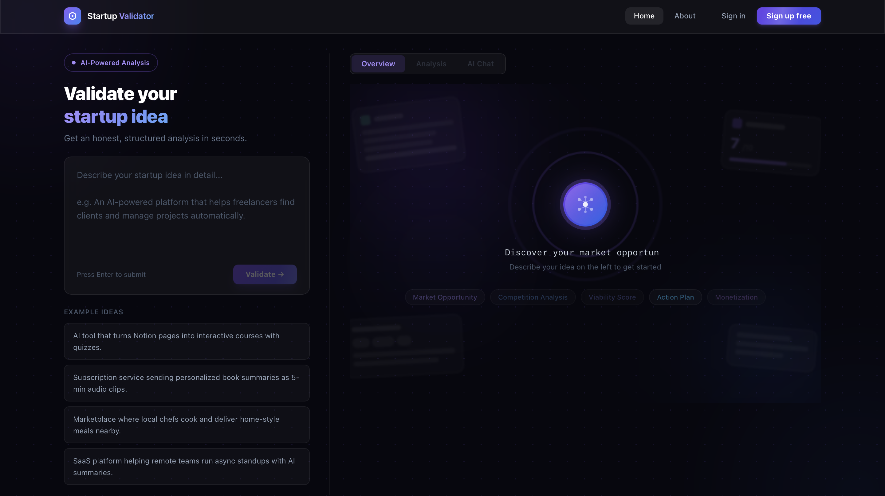
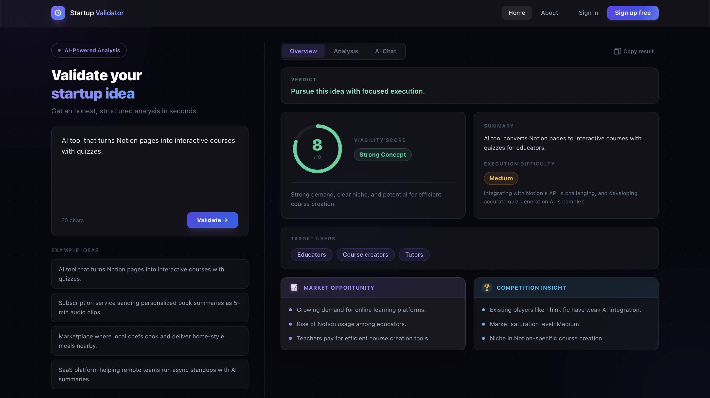
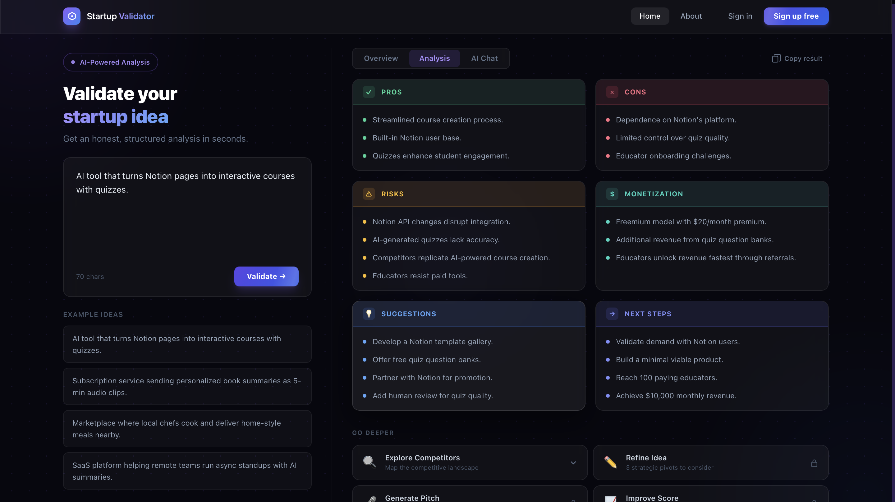
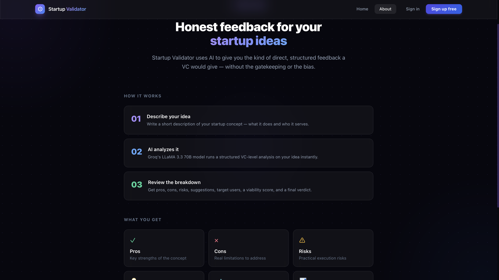

<div align="center">


<br /><br />

<h1>⬡ Startup Idea Validator</h1>

<p><strong>Instant, brutally honest AI analysis for your startup idea — before you spend 6 months building the wrong thing.</strong></p>

<p>
  <a href="#-live-demo">View Demo</a> ·
  <a href="#-installation">Quick Start</a> ·
  <a href="#-features">Features</a> ·
  <a href="#️-tech-stack">Tech Stack</a>
</p>

</div>

---

## 🧭 Overview

Most startup ideas fail from lack of validation, not execution. Founders build for months only to find the market doesn't care.

**Startup Idea Validator** fixes that. Describe your idea in plain language → get a structured, VC-style analysis in under 10 seconds: market opportunity, competition, monetization, risks, and a viability score.

Designed as a structured decision-support tool rather than a generic chatbot — every output is tied to a strict 13-field schema engineered to surface what actually matters.

> Think of it as a co-founder who's read every YC post-mortem and won't sugarcoat anything.

---

## ✨ Features

| | Feature | Description |
|---|---|---|
| 🔬 | **Deep-Structure Analysis** | 9 dimensions: market timing, named competitors, realistic pricing, and next steps scoped to 48h → 90 days |
| 📊 | **Viability Score** | 1–10 integer with 2–3 sentence reasoning tied to *your specific idea* |
| 🗂️ | **Three-Tab Results** | Overview · Analysis · AI Chat — each focused, no information overload |
| 🤖 | **Conversational Follow-ups** | Post-analysis AI chat for competitor mapping, pitch generation, and pivots |
| 🎤 | **Elevator Pitch Generator** | 30-second investor pitch: Hook → Problem → Solution → Why Now → Ask |
| 🔐 | **Feature Gating** | Free tier for analysis; advanced features (pitch, refine, improve) behind a sign-up modal |
| ⚡ | **Sub-10s via Groq** | LLaMA 3.3 70B on Groq — ~2s inference, 30+ structured data points per response |
| 🎨 | **Premium Dark UI** | Glassmorphism, animated AI orb, count-up score, typewriter text — zero UI library deps |

---

## ⚙️ How It Works

```
1. Describe your idea       →  Plain-language input
2. Express proxy receives   →  API key stays server-side, never in the browser
3. Groq runs analysis       →  400-word system prompt enforces strict 13-field JSON schema
4. Results animate in       →  Score counts up, arc fills, cards stagger on entry
5. Go deeper                →  Chat tab for pitch, competitors, refinements — all context-aware
```

---

## 📸 Screenshots

**Empty State** — Animated AI orb with pulsing rings, floating blurred preview cards, typewriter text



**Overview Tab** — Verdict banner, viability score with count-up animation, target users, market opportunity



**Analysis Tab** — Pros, cons, risks, monetization, suggestions, next steps + expandable action buttons



**About Page** — How it works, what you get, tech stack



---

## 🛠️ Tech Stack

| Layer | Technology | Purpose |
|---|---|---|
| **Frontend** | React 18 + Vite | UI components, fast HMR |
| **Styling** | Tailwind CSS v3 | Utility-first, no UI library |
| **Animations** | Custom CSS keyframes | Orb, float, count-up, typewriter |
| **Routing** | React Router v7 | SPA (Home, About) |
| **Backend** | Express.js v5 | API proxy, secure key handling |
| **AI Model** | LLaMA 3.3 70B | Structured startup analysis |
| **Inference** | Groq API | ~2s latency, no cold starts |
| **Auth** | React Context | Client-side session (mock) |

---

## 🔑 Key Highlights

**Prompt engineering is the product.** A 400-word system prompt enforces specific, non-generic output — no banned buzzwords, idea-specific examples, 13 typed JSON fields. The model is a commodity; the prompt is the moat.

**Security by design.** The Groq API key never reaches the browser. Express validates input, handles typed errors (401/429/500), and strips markdown fences before JSON parsing.

**Real SaaS product thinking.** Free tier delivers immediate value. Locked features surface post-analysis — at the right moment — not behind a wall on first load.

**Lean bundle.** Every component is hand-built with Tailwind. No Shadcn, Radix, MUI, or Framer Motion. Result: **69 kB gzipped.**

---

## 🔮 Future Improvements

- 💾 **Persistent history** — Store and compare past validations in localStorage
- 📄 **PDF export** — One-click formatted analysis download
- 🔁 **Idea versioning** — Track score changes across refinement iterations
- 🔗 **Shareable links** — Read-only view for validated ideas
- 🧪 **Multi-model comparison** — Run same idea through multiple models side-by-side
- 🔐 **Real auth** — Replace mock auth with Supabase or Clerk

---

## 🚀 Installation

**Prerequisites:** Node.js ≥ 18 · [Free Groq API key](https://console.groq.com) (no card required)

```bash
# 1. Clone
git clone https://github.com/your-username/startup-idea-validator.git
cd startup-idea-validator

# 2. Install
npm install

# 3. Configure
cp .env.example .env
# Add your key: GROQ_API_KEY=gsk_your_key_here

# 4. Run (two terminals)
npm run server   # API proxy → localhost:3001
npm run dev      # Frontend  → localhost:5173
```

---

## 🌐 Live Demo

> 🔗 **[startup-validator.demo](https://your-demo-url.vercel.app)** ← *(replace with your deployed URL)*

```bash
npm run build
# Deploy /dist to Vercel or Netlify
# Deploy server.js to Railway, Render, or Fly.io
# Update src/api/validateIdea.js with your server URL
```

---

## 📁 Project Structure

```
startup-idea-validator/
├── server.js                    # Express proxy + Groq integration
└── src/
    ├── api/validateIdea.js      # validateIdea() + callAction()
    ├── components/
    │   ├── AuthModal.jsx        # Sign in / sign up modal
    │   ├── EmptyState.jsx       # Animated orb + typewriter
    │   ├── InputPanel.jsx       # Textarea + example chips
    │   ├── Navbar.jsx           # Sticky header + auth state
    │   ├── ResultPanel.jsx      # 3-tab results + chat + actions
    │   ├── ScoreCircle.jsx      # SVG arc + count-up
    │   └── SkeletonLoader.jsx   # Shimmer loading state
    ├── context/AuthContext.jsx  # Mock auth state
    ├── pages/
    │   ├── Home.jsx             # Two-column layout
    │   └── About.jsx            # How it works page
    └── App.jsx                  # Router + AuthProvider
```

---

## 💡 What I Learned

- Designing AI tools beyond chat interfaces
- Improving UX for interactive workflows
- Structuring real-world product features
- Handling API security with backend proxy

---

<div align="center">

Built by **Reshma** · Powered by [Groq](https://groq.com)

⭐ **Star this repo if it saved you from building the wrong thing.**

</div>
